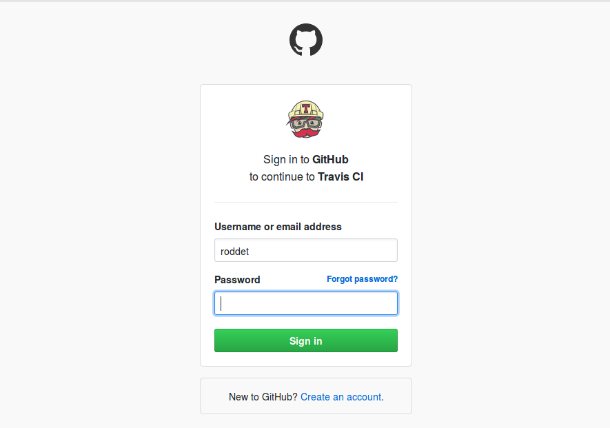
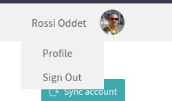
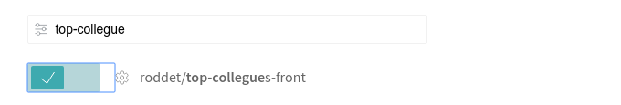
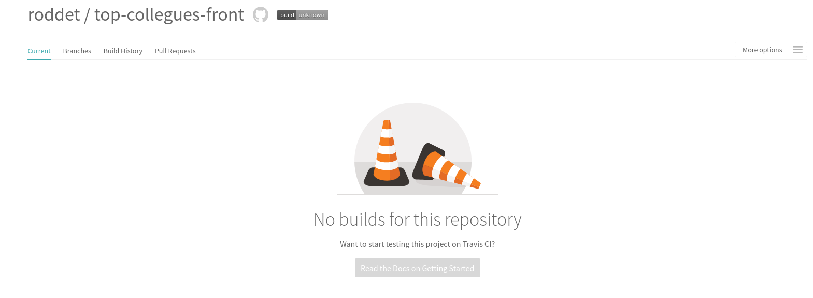
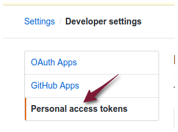
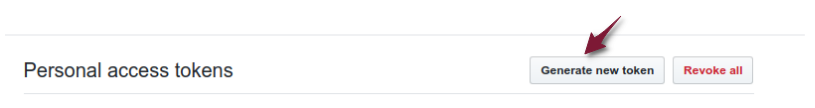
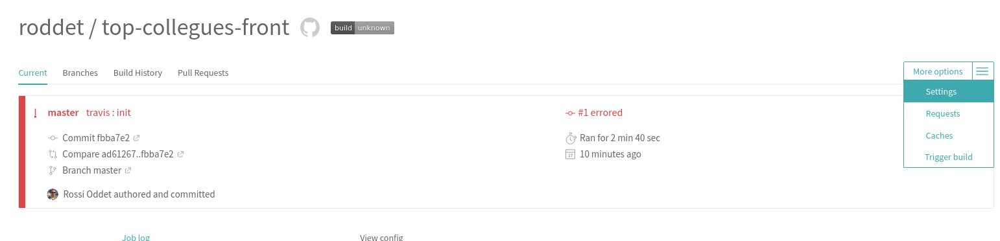
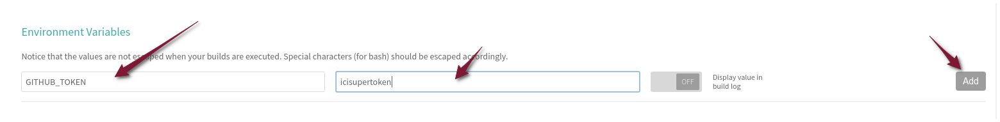
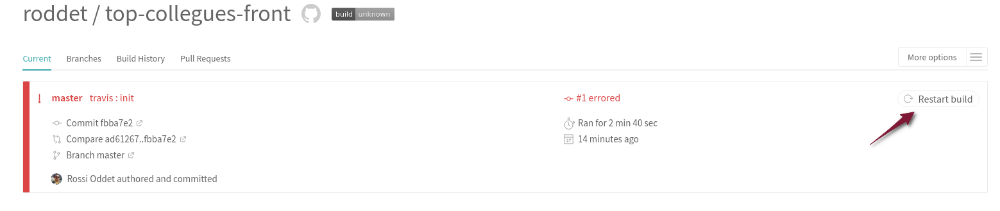
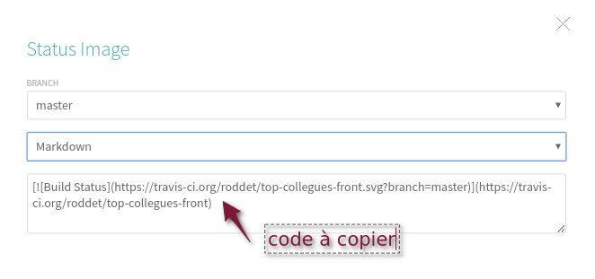

# Top Collègues #1

L'objectif de ce TP est de réaliser une application qui permet de classer des collègues.

## Initialisation du projet

* Créer une nouvelle application :

```
ng new top-collegues-front --skip-tests
```

## Déploiement automatique de l'application sur la branche `gh-pages`

* Créer un fork du dépôt `top-collegues-front` fourni. 

* S'authentifier à l'aide de votre compte Github sur le site : https://travis-ci.org/.




* Se rendre sur votre profil (menu *Profile*)



* Cliquer sur le bouton *Sync account*.

* Effectuer une recherche du dépôt `top-collegues-front` et activer le dépôt.




* Cliquer sur le dépôt (dans l'exemple `roddet/top-collegues-front`).



* Ajouter au code source du projet un fichier `.travis.yml` :

```yaml
language: node_js
node_js:
  - "9"
before_script:
  - npm install
script: npm run build
deploy:
  local-dir: dist/top-collegues-front
  provider: pages
  skip-cleanup: true
  github-token: $GITHUB_TOKEN  # Set in travis-ci.org dashboard, marked secure
  keep-history: true
  on:
    branch: master
notifications:
  email: false
  slack: diginamic:nIQwPkWk2zfq2fjtzxMWhuBD#travis-callofdta
```

* Mettre à jour le fichier `package.json` comme suit (adapter le nom de l'utilisateur):

```json
  "scripts": {
    ...
    "build": "ng build --prod --base-href https://NOM_UTILISATEUR.github.io/top-collegues-front/",

```

* Publier les modifications sur Github.

* Une construction *Travis* se lance automatiquement.


* La construction échouera. C'est normal, la variable d'environnement `GITHUB_TOKEN` n'est pas paramétrée dans Travis.

* Se rendre dans le paramétrage Github


* Se rendre dans la rubrique *Developer settings*.


* Se rendre dans la rubrique *Personal access tokens*.



* Cliquer sur *Generate new token*.



* Générer un token avec les droits sur vos dépôts publiques. 


* Copier le token généré. Nous allons à présent mettre à jour Travis.

* Se rendre dans le paramétrage du job Travis (rubrique *Settings*)



* Ajouter la variable d'environnement `GITHUB_TOKEN`.



* Relancer la construction.



* Après la fin de la construction, vérifier que la branche `gh-pages` a bien été créée sur le dépôt Github.

* Vérifier l'application déployée : http://NOM_UTILISATEUR_GITHUB.github.io/top-collegues-front

* Cliquer sur l'icône `build`


* Copier le code en version Markdown.



* Mettre à jour le fichier `README.md` avec :
 * le code de l'icône `build` copié
 * l'adresse du site en ligne. 

A ce stade à chaque fois que la branche `master` sera mise à jour, l'application sera déployée automatiquement par Travis.

## (optionnel) Intégration Angular Bootstrap with Material Design

Pour réaliser les composants graphiques, nous allons utilisé [Angular Bootstrap with Material Design](https://mdbootstrap.com/angular/).

* Installer MDB

```
 npm install angular-bootstrap-md chart.js@2.5.0 font-awesome hammerjs rxjs-compat --save
```

* Compléter le fichier `.angular.json` en ajoutant la propriété `styleext` avec la valeur `scss`.

```json
{
  ...
  "projects": {
    "top-collegues-front": {
      ...
      "schematics": {
        "@schematics/angular:class": {
          ...
        },
        "@schematics/angular:component": {
          ...
          "styleext": "scss"
        },
```

* Renommer `src/styles.css` en `styles.scss`.

* Mettre à jour le module `src/app/app.module.ts` en ajoutant le module : `MDBBootstrapModule`.

```ts

// ...
import { MDBBootstrapModule } from 'angular-bootstrap-md';

@NgModule({
    // ...
    imports: [
        BrowserModule,
        MDBBootstrapModule.forRoot()
    ]
    //...
});

```

* Compléter le fichier `.angular.json`

```json
{
  ...
  "projects": {
    "top-collegues-front": {
     ...
      
      "architect": {
        "build": {
          ...
          "options": {
            ...
            "styles": [
              "node_modules/font-awesome/scss/font-awesome.scss",
              "node_modules/angular-bootstrap-md/scss/bootstrap/bootstrap.scss",
              "node_modules/angular-bootstrap-md/scss/mdb-free.scss",
              "src/styles.scss"
            ],
            "scripts": [
              "node_modules/chart.js/dist/Chart.js",
              "node_modules/hammerjs/hammer.min.js"
            ]
          },
          ...
        },
        ...
      }
    },
    "...
  },
 ...
}

```

* Compléter le fichier `tsconfig.json`

```json
"include": ["node_modules/angular-bootstrap-md/**/*.ts",  "src/**/*.ts"],
```

* Tester la modification en local

```
ng serve
```

* Publier vos modifications sur Github et vérifier que le site en ligne a pris en compte vos modifications.
