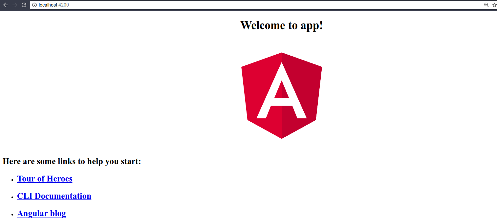
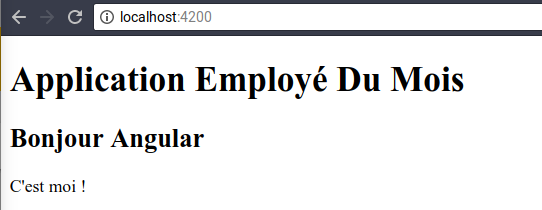

# TP - Comprendre les composants

## Prérequis

* Installer Node 6.9.0+ et NPM 3.0.0+ (https://nodejs.org/).

* Installer Typescript.

```
npm i -g typescript
```

* Installer Angular CLI.

```
npm i -g @angular/cli
```

Vérifier l'installation du client :

```
ng --version

    _                      _                 ____ _     ___
   / \   _ __   __ _ _   _| | __ _ _ __     / ___| |   |_ _|
  / △ \ | '_ \ / _` | | | | |/ _` | '__|   | |   | |    | |
 / ___ \| | | | (_| | |_| | | (_| | |      | |___| |___ | |
/_/   \_\_| |_|\__, |\__,_|_|\__,_|_|       \____|_____|___|
               |___/

Angular CLI: 1.5.0
Node: 6.11.5
OS: linux x64
Angular:
...
```

## Première application Angular

* Créer une application :

```
ng new bonjour-angular --skip-tests
```

Arborescence obtenue :

```
/bonjour-angular
    /e2e                // tests end to end
    /src                // sources de l'application
    .angular.json   // configuration angular-cli
    .editorconfig
    .gitignore
    karma.conf.js       // configuration lanceur de test
    package.json
    protractor.conf.js  // configuration tests end to end
    README.md
    tsconfig.json       // configuration compilateur typescript
    tslint.json         // qualité du code typescript
```

* Démarrer l'application

```
cd bonjour-angular
ng serve
```

* Se rendre à l'adresse suivante avec un navigateur : http://localhost:4200



## Premier composant Angular

Angular adopte une approche basée sur des composants.

L'idée est d'étendre HTML et de fournir des balises supplémentaires personnalisées.

Nous allons à présent créer le composant _bonjour_ qui pourrait s'utiliser comme suit dans une page HTML :

```html
<app-bonjour></app-bonjour>
```

Angular CLI offre la commande _generate_ qui permet de générer un composant.

* Générer le composant _bonjour_ :

```
ng generate component bonjour
```

* Modifier le fichier _src/app/bonjour/bonjour.component.html_ comme suit :


```html
<h2>Bonjour Angular</h2>
<p>
  C'est moi !
</p>
```

* Modifier le fichier `src/app/app.component.html`.

```html
<h1>Application Employé Du Mois</h1>

<app-bonjour></app-bonjour>
```

* Vérifier le résultat :



## Afficher une donnée

* Créons à présent un nouveau composant _bonjour-avec-prenom_ :

```
ng generate component bonjour-avec-prenom
```

* Modifier le composant (`bonjour-avec-prenom.component.ts`) comme suit :


```ts
import { Component, OnInit } from '@angular/core';

@Component({
  selector: 'app-bonjour-avec-prenom',
  templateUrl: './bonjour-avec-prenom.component.html',
  styleUrls: ['./bonjour-avec-prenom.component.css']
})
export class BonjourAvecPrenomComponent implements OnInit {


  prenom:string; // ajout d'une propriété

  constructor() {
    this.prenom = 'Philippe'; // valorisation de la propriété
  }

  ngOnInit() {

  }

}
```

* Modifier le fichier HTML `bonjour-avec-prenom.component.html` comme suit :

```html
<p>
Bonjour {{prenom}}
</p>
```

* Modifier le fichier `src/app/app.component.html`.

```html
<h1>Application Employé Du Mois</h1>

<app-bonjour></app-bonjour>

<app-bonjour-avec-prenom></app-bonjour-avec-prenom>
```

* Tester le résultat :


## Afficher un tableau de données

* Créons à présent un nouveau composant `bonjour-les-collegues` :

```
ng generate component bonjour-les-collegues
```


* Modifier le composant `bonjour-les-collegues.component.ts` comme suit :

```ts
import { Component, OnInit} from '@angular/core';

@Component({
  selector: 'app-bonjour-les-collegues',
  templateUrl: './bonjour-les-collegues.component.html',
  styleUrls: ['./bonjour-les-collegues.component.css']
})
export class BonjourLesColleguesComponent implements OnInit {

  collegues:string[];

  constructor() {
    this.collegues = ['Yves', 'Landry', 'Bob']
  }

  ngOnInit() {
  }

}
```

* Modifier le fichier HTML `bonjour-les-collegues.component.html` comme suit :

```html
<ul>
  <li *ngFor="let col of collegues">Bonjour {{col}}</li>
</ul>
```

* Modifier le fichier `src/app/app.component.html`

```html
<h1>Application Employé Du Mois</h1>

<app-bonjour></app-bonjour>

<app-bonjour-avec-prenom></app-bonjour-avec-prenom>

<app-bonjour-les-collegues></app-bonjour-les-collegues>
```

* Tester le résultat :


## Paramètre d'un composant

Faisons à présent évoluer le composant `app-bonjour-avec-prenom` pour que le prénom qu'il affiche soit paramétrable.

Le composant devra alors s'utiliser comme suit :


```html
<app-bonjour-avec-prenom [prenom]="'Julien'"></app-bonjour-avec-prenom>
```

La syntaxe _[prenom]_ permet de spécifier un paramètre à un composant.

* Modifier le composant `bonjour-avec-prenom.component.ts` comme suit :

```ts
import {
    Component,
    OnInit,
    Input // ajouter l'import du composant Input
} from '@angular/core';

@Component({
  selector: 'app-bonjour-avec-prenom',
  templateUrl: './bonjour-avec-prenom.component.html',
  styleUrls: ['./bonjour-avec-prenom.component.css']
})
export class BonjourAvecPrenomComponent implements OnInit {


  @Input() prenom:string; // déclarer que ce champ est un paramètre du composant

  constructor() {
     // ici plus de valorisation de la propriété du composant
  }

  ngOnInit() {

  }
}
```

* Modifier le composant `app-bonjour-les-collegues.html` comme suit :

```html
<ul>
  <li *ngFor="let col of collegues">

    <app-bonjour-avec-prenom [prenom]="col"></app-bonjour-avec-prenom> <!-- remplacer le texte par l'utilisation du composant  bonjour-avec-prenom-->

  </li>
</ul>
```

* Tester.


## Point d'entrée

Au fait, qu'est-ce qui se passe quand je fais _ng serve_ ? Quel est le point d'entrée de l'application ?

La commande `ng` vient de l'outil *Angular CLI*.

Ce dernier est configurable via le fichier `.angular.json`.

Le point d'entrée de l'application y est défini via l'attribut `main` :


```json
{
  "$schema": "./node_modules/@angular/cli/lib/config/schema.json",
  "version": 1,
  "newProjectRoot": "projects",
  "projects": {
    "NOM_DU_PROJET": {
      "architect": {
        "build": {
          "builder": "@angular-devkit/build-angular:browser",
          "options": {
            ...
            "main": "src/main.ts",
```

Dans ce cas, il s'agit du fichier `main.ts`.

```ts
import { enableProdMode } from '@angular/core';
import { platformBrowserDynamic } from '@angular/platform-browser-dynamic';

import { AppModule } from './app/app.module';
import { environment } from './environments/environment';

if (environment.production) {
  enableProdMode();
}

// le module de démarrage est AppModule issu du fichier src/app/app.module.ts.
platformBrowserDynamic().bootstrapModule(AppModule)
  .catch(err => console.log(err));
```

```ts
@NgModule({
  declarations: [
    AppComponent,
    BonjourComponent,
    BonjourAvecPrenomComponent,
    BonjourLesColleguesComponent
  ],
  imports: [
    BrowserModule
  ],
  providers: [],
  bootstrap: [AppComponent]
})
export class AppModule { }
```

* `declarations` : spécifie les composants définis dans le module. Pour utiliser un composant dans un template il faut qu'il soit déclaré.

* `imports` : décrit les dépendances du module.

* `providers` : utilisé dans le cadre de l'injection de dépendances.

* `bootstrap` : spécifie à Angular que lorsqu'un module est chargé, il faut charger le composant configuré.

