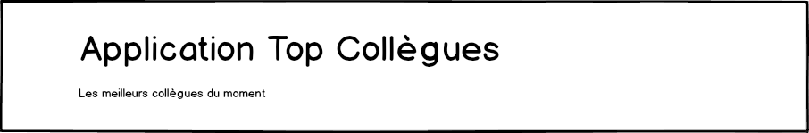
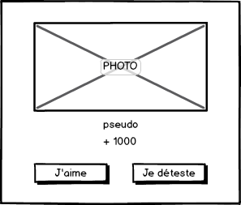
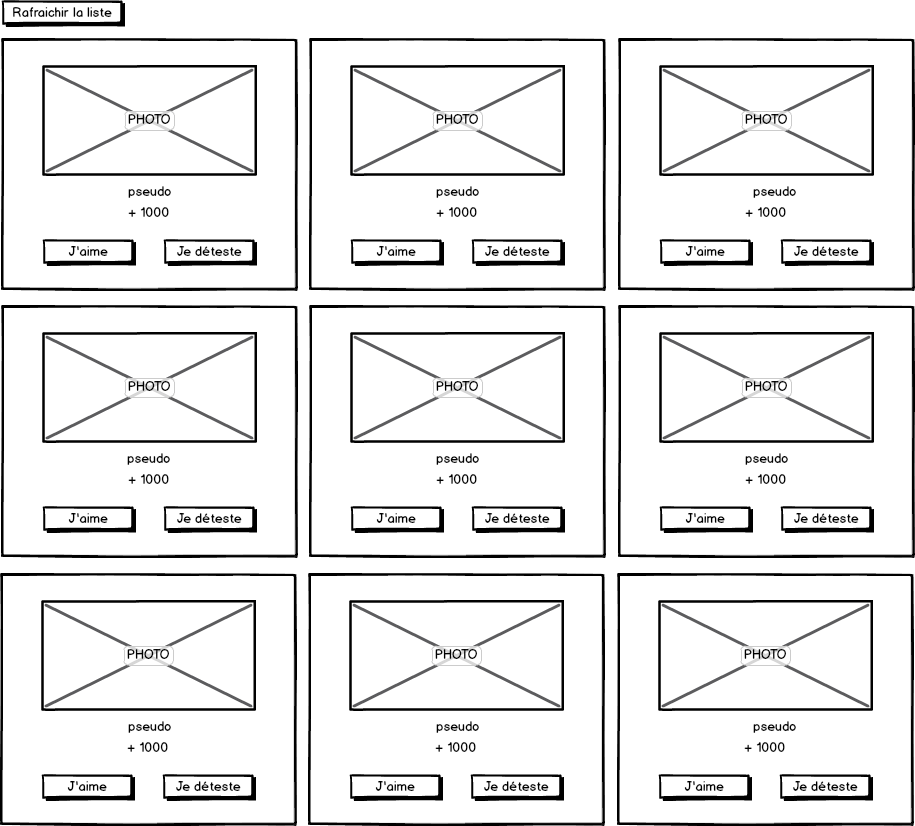
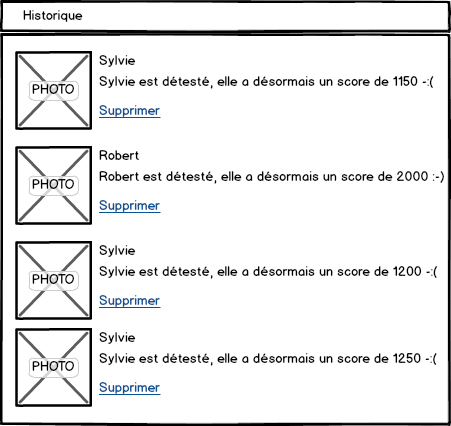

# Top Collègues #2

## DemoComponent

Avant de nous lancer dans la création de l'application, nous allons créer unitairement les composants.

Ces composants vont être regroupées dans un composant `DemoComponent` qui montre un exemple d'utilisation de tous les composants de l'application.

```
ng g component demo
```

* Modifier le contenu du composant App (`app.component.html`) comme suit :

```html
<app-demo></app-demo>
```

* Modifier le fichier `demo.component.html` comme suit :

```html
<h1>Page de démonstration des composants de l'application</h1>
```

* Tester l'application et vérifier l'affichage de l'application.

## BandeauComponent

* Créer un composant `BandeauComponent` qui affiche un titre et une description.



* Modifier la page de démo pour vérifier le fonctionnement du composant `BandeauComponent`.


## AvisComponent

* Créer un composant `AvisComponent` qui affiche 2 boutons.


* Intégrer ce composant à la page de démonstration (précédé par le titre *AvisComponent*).

* Vérifier l'affichage des deux boutons.

* Créer un fichier `src/app/models.ts` qui va héberger toutes les structures d'encapsulation des données.

* Ajouter au fichier `src/app/models.ts` une énumération `Avis` avec deux valeurs possibles : `AIMER` et `DETESTER`.

* Modifier le composant `AvisComponent` pour qu'il émette un événement `avis` avec la valeur `Avis.AIMER` ou `Avis.DETESTER` en fonction du bouton cliqué.

* Modifier la page de démo pour vérifier le fonctionnement du composant `AvisComponent`.


## CollegueComponent

* Créer un composant `CollegueComponent` le score d'un collègue et offre la possibilité d'émettre un avis.



* Ce composant prend en entrée un objet de type `Collegue`.
Ajouter au fichier `src/app/models.ts` une classe `Collegue` avec les informations nécessaires indispensable à cette page.

* Compléter la page de démonstration pour vérifier le fonctionnement du composant `CollegueComponent`. Créer un objet `Collegue` fictif pour l'affichage.

## ListeColleguesComponent

* Créer un composant `ListeColleguesComponent` qui, à partir d'une liste d'objets collègues, produit l'affichage suivant :



* Ce composant a en entrée un tableau d'objets Collegues.

* Modifier la page de démo pour vérifier le fonctionnement du composant `ListeColleguesComponent`.
Créer une liste de collègues fictives.


## HistoriqueVotesComponent

* Créer un composant `HistoriqueVotesComponent` qui affiche les derniers votes.



* Créer dans le fichier `src/app/models.ts`, une structure `Vote` permettant de représenter le vote d'un collègue.

* Le bouton `Supprimer` supprime le vote concerné.
* Compléter la page de démonstration pour vérifier le fonctionnement du composant `HistoriqueVotesComponent`.
Créer un tableau d'objets `Vote` fictifs pour l'affichage.

## AccueilComponent

* Créer un composant `AccueilComponent` qui a le rendu suivant :


* Modifier le composant `AppComponent` pour qu'il affiche désormais le composant `AccueilComponent`.

* A ce stade, `AccueilComponent` fonctionne avec des données fictives.


## Limitation sur les scores

Mettre en oeuvre le comportement suivant :

* Si le score est <= -1000, alors le bouton `Je déteste` se désactive.

* Si le score est >= 1000 alors le bouton `J'aime` se désactive


