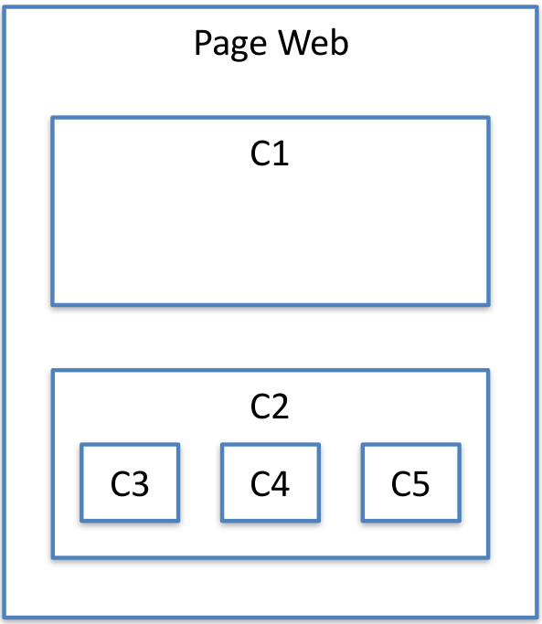

# Composant - introduction

Angular permet de créer une application avec une approche par composant.

Le principe :
* Créer des composants ayant des responsabilités bien définies.
* Assembler les composants pour réaliser une application.

