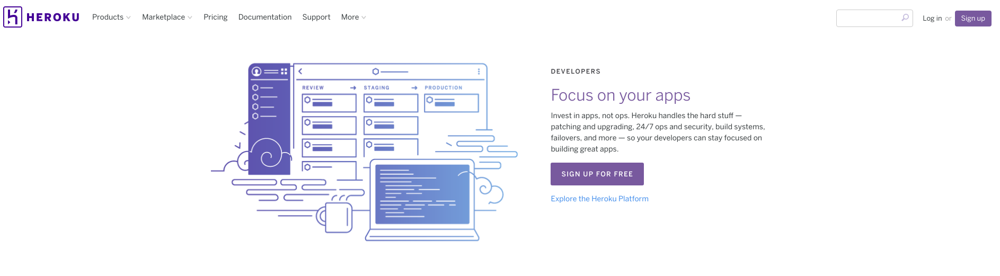
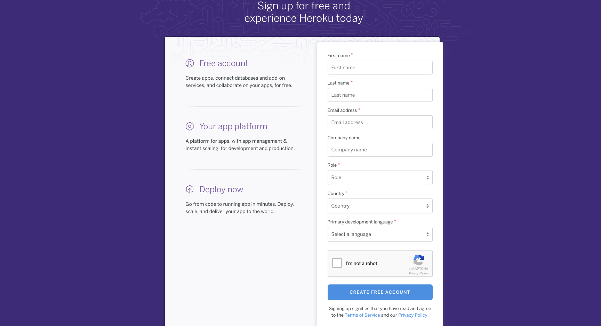
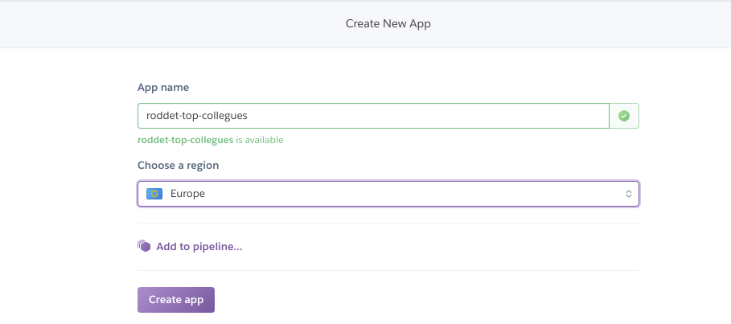
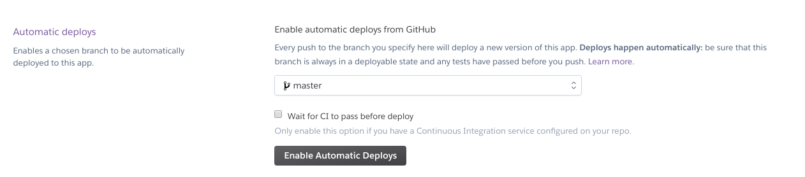
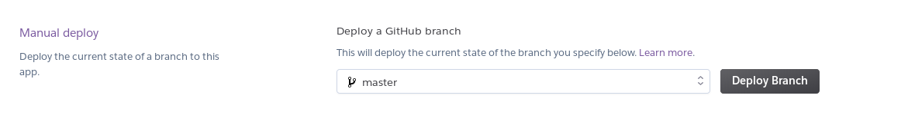
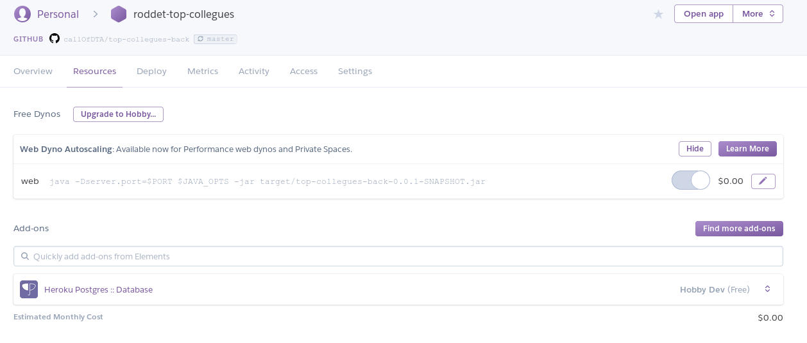

# Top Collègues #3

## Application Backend

* Créer (ou Fork) une application Spring Boot _top-collegues-backend_.

```
spring init --dependencies=web,data-jpa,devtools,h2 top-collegues-backend
```

## Déploiement Heroku

* Aller sur le site d'Heroku : https://www.heroku.com/ et Cliquer sur `Signup`.



* Remplir le formulaire d'inscription.



* Cliquer sur `Create new App`.


* Donner un nom unique à l'application.



* Cliquer sur Github, se connecter à Github


* Sélectionner votre projet (version fork)


* Activer le déploiement automatique en cliquant sur `Enable Automatic Deploys`.

 

* Cliquer sur `Deploy Branch`.



* Pour visualiser les logs, cliquer sur `More > View logs`.


* Une fois l'application déployée, tester la Web API : https://NOM_APPLICATION.herokuapp.com/versions.

 * Exemple : https://roddet-top-collegues.herokuapp.com/versions
 * Exemple de réponse.

```json
[{"id":1,"name":"v1"},{"id":2,"name":"v2"},{"id":3,"name":"v3"},{"id":4,"name":"v4"}]
```

Les données sont stockées dans une base PostgreSQL automatiquement configurée par Heroku.

Les informations de connexion sont consultables dans la rubrique `Resource` (en cliquant sur la base de données).



Si vous souhaitez visualiser le contenu de la base de données distante, vous pouvez installer le client [PgAdmin](https://www.pgadmin.org/).

## Service Backend

* Exposer le service _GET /collegues_ qui récupère la liste des collègues au format JSON. Voici un exemple de réponse :

```json
[
    {
      "score": 100,
      "pseudo": "Rod",
      "imageUrl": "https://images.pexels.com/photos/265036/pexels-photo-265036.jpeg?w=1260&h=750&auto=compress&cs=tinysrgb"
    },
    {
      "score": 800,
      "pseudo": "Alice",
      "imageUrl": "https://images.pexels.com/photos/265036/pexels-photo-265036.jpeg?w=1260&h=750&auto=compress&cs=tinysrgb"
    }
]
```

* Exposer un service _PATCH /collegues/PSEUDO/_ qui permet de mettre à jour le score d'un collègue.

Le corps de la réquête sera de la forme :

```json
{ "action" : "AIMER" }

// ou

{ "action" : "DETESTER"}

```
Ce service retourne l'objet Collegue à jour.

L'action `AIMER` incrémente le score de 10 points.

L'action `DETESTER` décrémente le score de 5 points.

## Front - Gérer les URLs backend

Notre application front va communiquer avec l'application back pour récupérer les données.

Il va falloir gérer 2 urls backend :
* `http://localhost:port` en mode développement
* `http://adresseheroku` en mode production

Vous pouvez pour cela utiliser le module environment `src/environments/environment`.

Vous configurez le fichier `src/environments/environment.ts` pour le mode développement. Exemple :

```ts

export const environment = {
  production: false,
  
  // ajout d'une URL backend en mode développement
  backendUrl: 'http://localhost:port'
};


```

Vous configurez le fichier `src/environments/environment.prod.ts` pour le mode production. Exemple :

```ts

export const environment = {
  production: true,
  
  // ajout d'une URL backend en mode développement
  backendUrl: 'http://adresseheroku'
};


```

A l'utilisation, :

```ts
import {environment} from '../../environments/environment';


// en développement, URL_BACKEND = 'http://localhost:port'
// en mode production, URL_BACKEND = 'http://adresseheroku'
const URL_BACKEND = environment.backendUrl;


```

## Front - Service `CollegueService`

* Générer un service _Collegue_.

```
ng g service services/Collegue
```

* Compléter le service collègue pour consommer les services backend :

```ts
@Injectable()
export class CollegueService {

  constructor() { }

  listerCollegues():Promise<Collegue[]>  {
    // récupérer la liste des collègues côté serveur
  }

  donnerUnAvis(unCollegue:Collegue, avis:Avis):Promise<Collegue>  {
    // TODO Aimer ou Détester un collègue côté serveur
  }

}
```

A ce stade :
* les données sont désormais récupérées d'une application backend.
* les actions `AIMER` ou `DETESTER` mettent à jour la base de données.
* aucune mise à jour n'est faite sur le composant `HistoriqueVotesComponent`.
