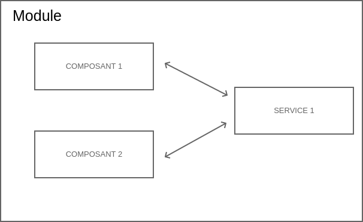

# Service

* Un service est l'unité de mutualisation de code dans Angular.





* Un service est une classe qui peut être injectée dans une autre.

* Quelques services sont fournis par le framework.

* Il est possible de créer ses propres services.

Pour générer un service :

```
ng generate service Personne
```