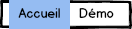
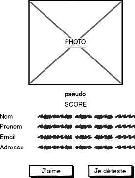

# Top Collègues #4

## MenuComponent

Créer un composant `MenuComponent` qui affiche une barre de navigation.

Le lien courant est identifié.

Le lien `Accueil` conduit au chemin `/accueil`.

Le lien `Démo` conduit au chemin `/demo`.

## /accueil

Mettre à jour l'application pour que le chemin `/accueil` :

* soit le chemin par défaut de l'application.
* conduise à l'affichage du composant `AccueilComponent` et du menu

## /demo

Mettre à jour l'application pour que le chemin `/demo` conduise à l'affichage du composant `DemoComponent` et du menu.

## /collegues/:pseudo

Compléter l'application pour que le lien `/collegues/robert` conduise à la page de détail du collègue Robert.

Désormais un clic sur le pseudo d'un collègue conduit à la page de détail de celui-ci.
