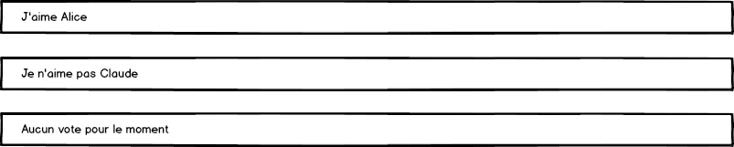

# Top Collègues #7


## Migration Promise => Observable

Modifier les services de l'application pour utiliser le type `Observable` à la place de `Promise`.

Exemple de signature :

```ts
@Injectable()
export class CollegueService {

  constructor() { }

  listerCollegues():Observable<Collegue[]>  {
    ...
  }

  donnerUnAvis(unCollegue:Collegue, avis:Avis):Observable<Collegue>  {
    // ...
  }

}

```


## VotreDernierAvisComponent

* Créer un composant dernier VotreDernierAvis qui affiche un texte représentant le dernier avis (validé par le serveur) que l'utilisateur a donné.



* Insérer ce composant en dessous de la barre de navigation.

* Ce composant reçoit des notifications uniquement d'un service.

## Historique

Nous souhaitons désormais conserver l'historique des votes.

### Backend API

Créer l'API _GET /votes?since=VOTE_ID_ qui retourne tous les votes depuis le vote ayant l'identifiant _VOTE_ID_.

Si l'attribut _since_ n'est pas valorisé, seuls les 3 derniers votes sont renvoyés.

Un vote est constitué :
* d'un collègue
* d'un avis
* d'une date/heure de création
* d'un score

(optionnel) Vous avez également la possibilité d'implémenter une alernative en WebSocket.

### Vue Historique

* Implémenter une mise à jour automatique du composant `HistoriqueVotesComponent` en envoyant une réquête au serveur toutes les 5 secondes.