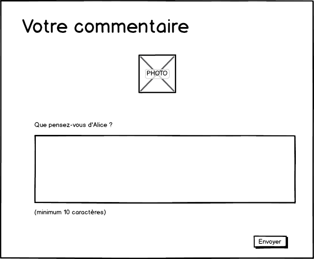

# Top Collègues #8

Appliquer ici, la technique de construction de formulaire pilotée par le modèle.

## Rédiger un avis

* Ajouter un bouton au composant `AvisComponent`.

(Vous avez le droit de remplacer le texte par des icônes).

Un clic sur le bouton "Je commente" affiche une fenêtre modale permettant de rédiger un avis.

Les contraintes :

* Le bouton "Envoyer" n'est accessible que si le commentaire possède au moins 10 caractères.

* Si le nombre de caractères excède 255, un message d'erreur s'affiche et le bouton "Enregistrer" devient inaccessible.

* Prévoyer le cas où l'enregistrement côté serveur échoue. Afficher alors un message explicite.

Compléter la page de détail d'un collègue pour afficher l'ensemble des commentaires saisis.