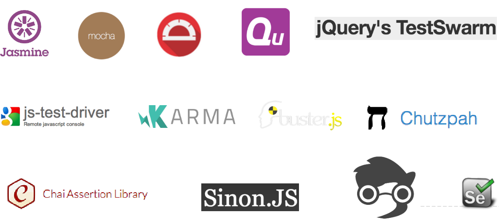
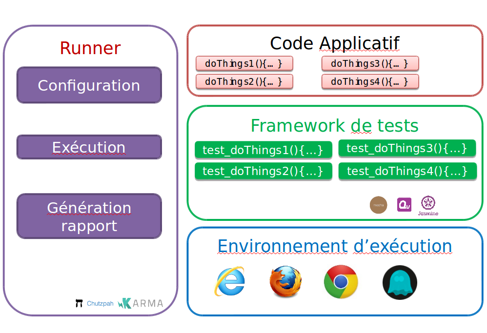

# Tests dans Angular

## Les catégories de tests

La structure modulaire d’une application Angular encourage la mise en oeuvre des tests.

Un test peut être :

* **unitaire** (Unit Test)
* **d'intégration** (E2E – End To End).


|Unitaire|E2E|
|:-:|:-:|
|Test du code|buffer|
|Intéragit avec le code|Intéragit avec le navigateur ou l’API du framework
|Utiliser le plus possible des _mock_|Utiliser le moins possible des  _mock_
|Ne requiert pas de serveur web|Requiert un serveur web
|Rapide|Lent


## De nombreux outils de tests frontend




# Organisation des tests



## Tests dans Angular

Angular fournit des utilitaires facilitant les tests dans un environnement de développement Angular.

Même s'il est possible d'utiliser différentes technologies pour réaliser les tests, Angular oriente vers les outils :

* [Jasmine](https://jasmine.github.io/) : framework de test.
* [Karma](https://karma-runner.github.io/) : lançeur de test.
* [Protractor](https://www.protractortest.org/) : tests end-to-end.

Angular CLI génère une configuration par défaut permettant de réaliser des tests unitaires en TypeScript.

Pour exécuter les tests unitaires :

```
npm test
```

Pour exécuter les tests end-to-end :

```
npm e2e
```
